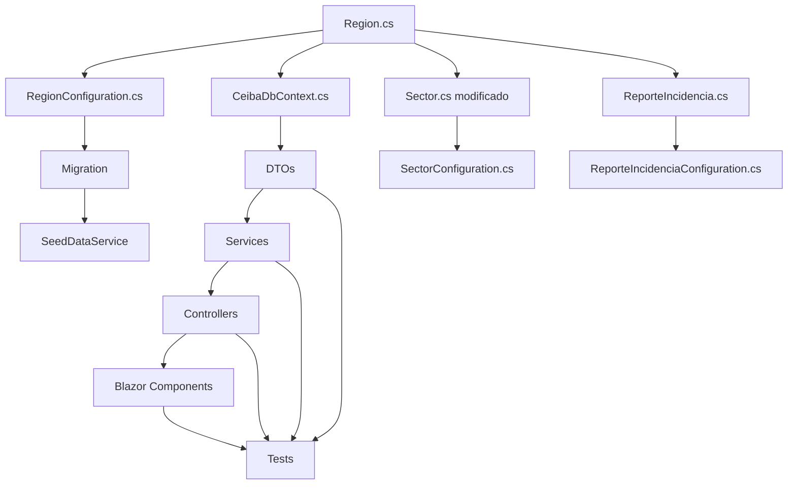

# Inventario de Archivos Afectados: Reestructuración Jerarquía Geográfica

**Fecha**: 2025-12-12
**Relacionado**: `PLAN-REGION-HIERARCHY-RESTRUCTURE.md`
**Total de archivos identificados**: 116

---

## Resumen por Categoría

| Categoría | Archivos | Acción Principal |
|-----------|----------|------------------|
| Entidades Core | 4 | Modificar |
| Interfaces Core | 2 | Modificar |
| Configuraciones EF | 5 | Modificar/Crear |
| Servicios Infrastructure | 7 | Modificar |
| Migraciones | 4 | Modificar |
| DTOs Shared | 4 | Modificar |
| Componentes Blazor | 9 | Modificar |
| Controladores Web | 3 | Modificar |
| Contratos API | 4 | Modificar |
| Especificaciones | 7 | Modificar |
| Tests | 34 | Modificar |
| Scripts | 8 | Modificar |
| Documentación | 15 | Modificar |
| Otros | 14 | Revisar |

---

## 1. Capa Core (`src/Ceiba.Core/`)

### Entidades
```
src/Ceiba.Core/Entities/Zona.cs           → MODIFICAR (navegación a Regiones)
src/Ceiba.Core/Entities/Sector.cs         → MODIFICAR (FK: ZonaId → RegionId)
src/Ceiba.Core/Entities/Cuadrante.cs      → REVISAR (sin cambios directos)
src/Ceiba.Core/Entities/ReporteIncidencia.cs → MODIFICAR (agregar RegionId)
```

### Interfaces
```
src/Ceiba.Core/Interfaces/ICatalogService.cs      → MODIFICAR (GetRegionesByZonaAsync)
src/Ceiba.Core/Interfaces/ICatalogAdminService.cs → MODIFICAR (CRUD Región)
```

### Archivo Nuevo
```
src/Ceiba.Core/Entities/Region.cs → CREAR
```

---

## 2. Capa Infrastructure (`src/Ceiba.Infrastructure/`)

### Configuraciones EF Core
```
src/Ceiba.Infrastructure/Data/Configurations/ZonaConfiguration.cs           → MODIFICAR
src/Ceiba.Infrastructure/Data/Configurations/SectorConfiguration.cs         → MODIFICAR (FK)
src/Ceiba.Infrastructure/Data/Configurations/CuadranteConfiguration.cs      → REVISAR
src/Ceiba.Infrastructure/Data/Configurations/ReporteIncidenciaConfiguration.cs → MODIFICAR
```

### Archivo Nuevo
```
src/Ceiba.Infrastructure/Data/Configurations/RegionConfiguration.cs → CREAR
```

### DbContext y Data
```
src/Ceiba.Infrastructure/Data/CeibaDbContext.cs          → MODIFICAR (DbSet<Region>)
src/Ceiba.Infrastructure/Data/SeedDataService.cs         → MODIFICAR (datos semilla)
src/Ceiba.Infrastructure/Data/AuditSaveChangesInterceptor.cs → MODIFICAR (auditoría)
src/Ceiba.Infrastructure/Data/Migrations/PerformanceIndexes.sql → MODIFICAR (índices)
```

### Servicios
```
src/Ceiba.Infrastructure/Services/CatalogService.cs       → MODIFICAR
src/Ceiba.Infrastructure/Services/CachedCatalogService.cs → MODIFICAR
src/Ceiba.Infrastructure/Services/CatalogAdminService.cs  → MODIFICAR
src/Ceiba.Infrastructure/Services/AiNarrativeService.cs   → REVISAR
src/Ceiba.Infrastructure/Services/AutomatedReportService.cs → REVISAR
```

### Repositorios
```
src/Ceiba.Infrastructure/Repositories/ReportRepository.cs → MODIFICAR (Include)
```

### Caching
```
src/Ceiba.Infrastructure/Caching/CacheKeys.cs → MODIFICAR
```

### Migraciones Existentes (referencia)
```
src/Ceiba.Infrastructure/Migrations/20251124223912_InitialCreate.cs
src/Ceiba.Infrastructure/Migrations/20251126182333_US1_AddReportFields.cs
src/Ceiba.Infrastructure/Migrations/20251212025242_FixDbContextPoolingCompatibility.cs
src/Ceiba.Infrastructure/Migrations/CeibaDbContextModelSnapshot.cs → MODIFICAR
```

### Migración Nueva
```
src/Ceiba.Infrastructure/Migrations/YYYYMMDD_AddRegionToHierarchy.cs → CREAR
```

---

## 3. Capa Application (`src/Ceiba.Application/`)

### Servicios
```
src/Ceiba.Application/Services/ReportService.cs → MODIFICAR
```

### Validadores
```
src/Ceiba.Application/Validators/ReportValidators.cs → MODIFICAR
```

### Exportación
```
src/Ceiba.Application/Services/Export/PdfGenerator.cs  → MODIFICAR
src/Ceiba.Application/Services/Export/ExportService.cs → MODIFICAR
```

---

## 4. Capa Shared (`src/Ceiba.Shared/`)

### DTOs
```
src/Ceiba.Shared/DTOs/AdminDTOs.cs           → MODIFICAR (RegionDto, SectorDto)
src/Ceiba.Shared/DTOs/ReportDTOs.cs          → MODIFICAR (RegionId en todos)
src/Ceiba.Shared/DTOs/Export/ReportExportDto.cs → MODIFICAR
src/Ceiba.Shared/DTOs/AutomatedReportDTOs.cs → REVISAR
```

---

## 5. Capa Web (`src/Ceiba.Web/`)

### Componentes Blazor - Reportes
```
src/Ceiba.Web/Components/Pages/Reports/ReportForm.razor       → MODIFICAR (cascada 4)
src/Ceiba.Web/Components/Pages/Reports/ReportList.razor       → MODIFICAR
src/Ceiba.Web/Components/Pages/Reports/ReportListRevisor.razor → MODIFICAR
src/Ceiba.Web/Components/Pages/Reports/ReportView.razor       → MODIFICAR
```

### Componentes Blazor - Admin
```
src/Ceiba.Web/Components/Pages/Admin/CatalogManager.razor → MODIFICAR (CRUD Región)
```

### Componentes Blazor - Otros
```
src/Ceiba.Web/Components/Shared/ReportFilter.razor           → MODIFICAR
src/Ceiba.Web/Components/Pages/Supervisor/ExportPage.razor   → MODIFICAR
src/Ceiba.Web/Components/Pages/Automated/TemplateList.razor  → REVISAR
src/Ceiba.Web/Components/Pages/Automated/AutomatedReportDetail.razor → REVISAR
```

### Controladores
```
src/Ceiba.Web/Controllers/AdminController.cs    → MODIFICAR (endpoints Región)
src/Ceiba.Web/Controllers/CatalogsController.cs → MODIFICAR (GetRegiones)
src/Ceiba.Web/Controllers/AuditController.cs    → REVISAR
```

---

## 6. Contratos API (`specs/.../contracts/`)

```
specs/001-incident-management-system/contracts/api-admin.yaml   → MODIFICAR
specs/001-incident-management-system/contracts/api-reports.yaml → MODIFICAR
specs/001-incident-management-system/contracts/api-audit.yaml   → MODIFICAR
specs/001-incident-management-system/contracts/api-auth.yaml    → REVISAR
```

---

## 7. Especificaciones (`specs/001-incident-management-system/`)

```
specs/001-incident-management-system/data-model.md   → MODIFICAR (ER, entidades)
specs/001-incident-management-system/spec.md         → MODIFICAR
specs/001-incident-management-system/plan.md         → MODIFICAR
specs/001-incident-management-system/tasks.md        → MODIFICAR
specs/001-incident-management-system/quickstart.md   → MODIFICAR
specs/001-incident-management-system/research.md     → REVISAR
specs/001-incident-management-system/risk-analysis.md → REVISAR
```

---

## 8. Tests

### Core Tests
```
tests/Ceiba.Core.Tests/ReporteIncidenciaTests.cs → MODIFICAR
tests/Ceiba.Core.Tests/RegionTests.cs            → CREAR
```

### Infrastructure Tests
```
tests/Ceiba.Infrastructure.Tests/Services/CatalogServiceTests.cs       → MODIFICAR
tests/Ceiba.Infrastructure.Tests/Services/CachedCatalogServiceTests.cs → MODIFICAR
tests/Ceiba.Infrastructure.Tests/Services/CatalogAdminServiceTests.cs  → MODIFICAR
tests/Ceiba.Infrastructure.Tests/Repositories/ReportRepositoryTests.cs → MODIFICAR
tests/Ceiba.Infrastructure.Tests/Caching/CacheKeysTests.cs             → MODIFICAR
tests/Ceiba.Infrastructure.Tests/AuditInterceptorTests.cs              → MODIFICAR
```

### Application Tests
```
tests/Ceiba.Application.Tests/ReportServiceTests.cs                        → MODIFICAR
tests/Ceiba.Application.Tests/Validators/CreateReportDtoValidatorTests.cs  → MODIFICAR
tests/Ceiba.Application.Tests/Validators/UpdateReportDtoValidatorTests.cs  → MODIFICAR
tests/Ceiba.Application.Tests/Services/Export/PdfGeneratorTests.cs         → MODIFICAR
tests/Ceiba.Application.Tests/Services/Export/JsonExporterTests.cs         → MODIFICAR
tests/Ceiba.Application.Tests/Services/Export/ExportServiceTests.cs        → MODIFICAR
tests/Ceiba.Application.Tests/Services/AutomatedReportServiceTests.cs      → REVISAR
tests/Ceiba.Application.Tests/Services/AiNarrativeServiceTests.cs          → REVISAR
```

### Web Tests
```
tests/Ceiba.Web.Tests/ReportFilterComponentTests.cs         → MODIFICAR
tests/Ceiba.Web.Tests/ReportFormComponentTests.cs           → MODIFICAR
tests/Ceiba.Web.Tests/Components/ReportListTests.cs         → MODIFICAR
tests/Ceiba.Web.Tests/Components/CatalogManagerTests.cs     → MODIFICAR
tests/Ceiba.Web.Tests/Controllers/AdminControllerTests.cs   → MODIFICAR
tests/Ceiba.Web.Tests/Controllers/AuditControllerTests.cs   → REVISAR
tests/Ceiba.Web.Tests/Controllers/ReportsControllerTests.cs → MODIFICAR
```

### Integration Tests
```
tests/Ceiba.Integration.Tests/DbContextTests.cs                    → MODIFICAR
tests/Ceiba.Integration.Tests/ReportContractTests.cs               → MODIFICAR
tests/Ceiba.Integration.Tests/CatalogContractTests.cs              → MODIFICAR
tests/Ceiba.Integration.Tests/AuthorizationMatrixTests.cs          → REVISAR
tests/Ceiba.Integration.Tests/InputValidationTests.cs              → MODIFICAR
tests/Ceiba.Integration.Tests/AutomatedReportJobTests.cs           → REVISAR
tests/Ceiba.Integration.Tests/CeibaWebApplicationFactory.cs        → MODIFICAR
tests/Ceiba.Integration.Tests/E2E/CeibaWebApplicationFactory.cs    → MODIFICAR
tests/Ceiba.Integration.Tests/Performance/SearchPerformanceTests.cs     → MODIFICAR
tests/Ceiba.Integration.Tests/Performance/ExportPerformanceTests.cs     → MODIFICAR
tests/Ceiba.Integration.Tests/Performance/UsabilityPerformanceTests.cs  → REVISAR
tests/Ceiba.Integration.Tests/Performance/ConcurrencyPerformanceTests.cs → REVISAR
```

---

## 9. Scripts

```
scripts/generate-dummy-reports.sql           → MODIFICAR
scripts/reset-database.ps1                   → REVISAR
scripts/reset-database-with-postgres.ps1     → REVISAR
scripts/README-dummy-reports.md              → MODIFICAR
scripts/verification/e2e-verification.sh     → MODIFICAR
scripts/verification/e2e-verification.ps1    → MODIFICAR
scripts/verification/db-health-check.sql     → MODIFICAR
scripts/migrations/validate-migration.sh     → MODIFICAR
```

---

## 10. Documentación

### Proyecto
```
CLAUDE.md       → MODIFICAR
MIGRATIONS.md   → MODIFICAR
```

### Docs
```
docs/GEOGRAPHIC-TEST-DATA.md       → MODIFICAR
docs/CASCADE-FIX-TESTING.md        → MODIFICAR
docs/E2E-VERIFICATION-CHECKLIST.md → MODIFICAR
docs/TEST-USERS.md                 → REVISAR
docs/US1-*.md                      → REVISAR (múltiples)
docs/US2-*.md                      → REVISAR
docs/US3-*.md                      → REVISAR
docs/US4-*.md                      → REVISAR
docs/VERIFICATION-REPORT.md        → REVISAR
```

### Especificaciones Previas
```
.specify/prelims/project.md      → REVISAR
.specify/prelims/entities.mmd    → MODIFICAR
```

---

## 11. Archivos Nuevos a Crear (Resumen)

| # | Ruta | Descripción |
|---|------|-------------|
| 1 | `src/Ceiba.Core/Entities/Region.cs` | Entidad Región |
| 2 | `src/Ceiba.Infrastructure/Data/Configurations/RegionConfiguration.cs` | Config EF Core |
| 3 | `src/Ceiba.Infrastructure/Migrations/YYYYMMDD_AddRegionToHierarchy.cs` | Migración |
| 4 | `tests/Ceiba.Core.Tests/RegionTests.cs` | Tests unitarios |
| 5 | `tests/Ceiba.Infrastructure.Tests/Services/RegionServiceTests.cs` | Tests servicio |

---

## 12. Prioridad de Modificación

### Alta (Bloquean otros cambios)
1. Entidades Core
2. Configuraciones EF Core
3. Migraciones
4. DTOs

### Media (Funcionalidad)
5. Servicios
6. Repositorios
7. Controladores
8. Componentes Blazor

### Baja (Documentación/Tests)
9. Tests
10. Documentación
11. Scripts

---

## 13. Dependencias entre Archivos



---

*Documento de referencia. Actualizar conforme se completen modificaciones.*
